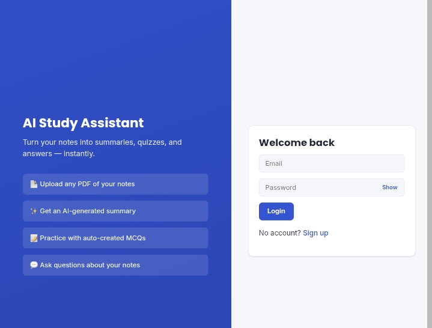
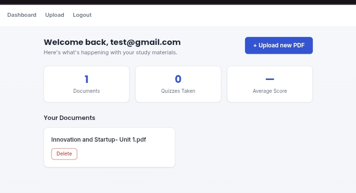
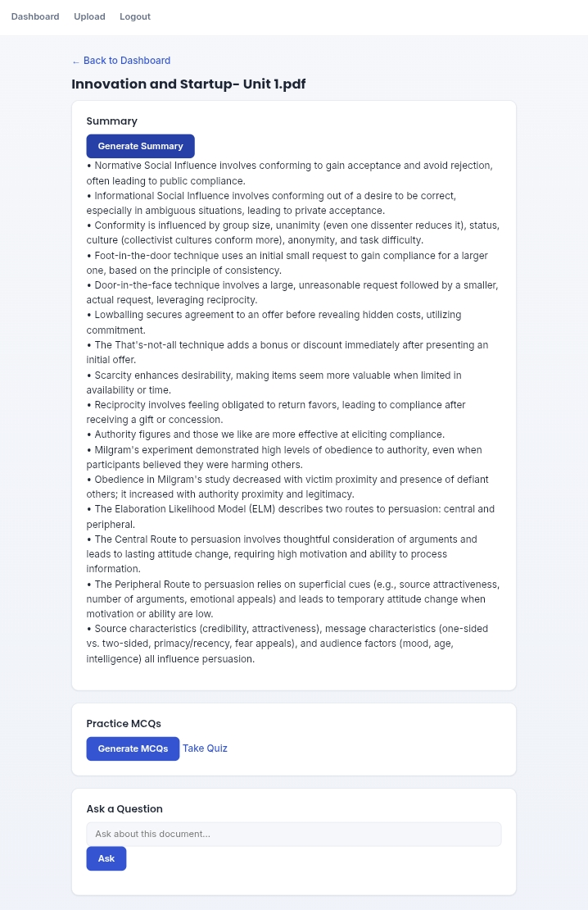
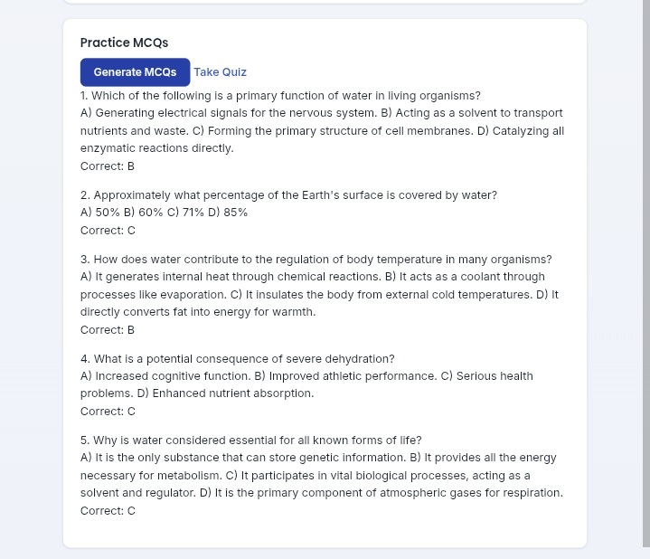
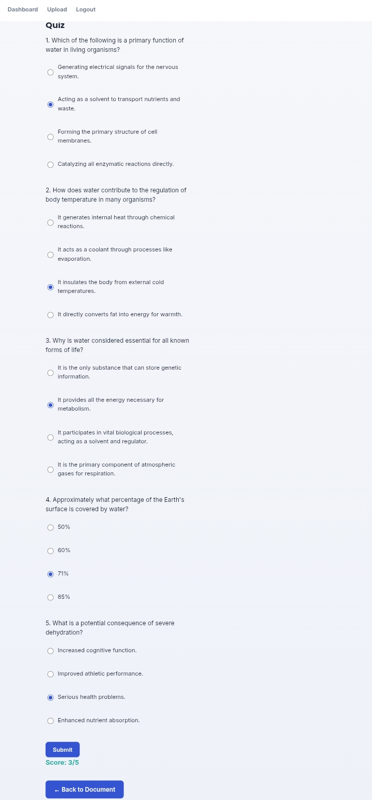

# 📚 AI Study Assistant

A cloud-based intelligent study assistant that turns your PDF notes into AI-generated summaries, practice quizzes, and an interactive Q&A — built as a college project.

🔗 **Live Demo:** [ai-study-assistant-ps14.onrender.com](https://ai-study-assistant-ps14.onrender.com)

> Note: Hosted on Render's free tier — the app may take 30-60 seconds to wake up on first load if it's been idle.

## ✨ Features

- 🔐 **Secure Auth** — Sign up / log in with Supabase Auth
- 📄 **PDF Upload** — Upload study notes as PDF, stored securely in Supabase Storage
- ✨ **AI Summaries** — Get a clean, bullet-point summary of your notes using Google Gemini
- 📝 **Auto-Generated MCQs** — Practice quizzes generated from your own notes
- 💬 **Ask Questions** — Chat with your notes to get instant, grounded answers
- 📊 **Quiz Scoring** — Take quizzes and track your score
- 🗑️ **Delete Documents** — Remove uploaded PDFs and their data anytime
- 📱 **Mobile Responsive** — Clean UI that works on desktop and mobile

## 🛠️ Tech Stack

| Layer | Technology |
|---|---|
| Backend | Flask (Python) |
| Database & Auth | Supabase (Postgres + Auth) |
| File Storage | Supabase Storage |
| AI | Google Gemini (`gemini-2.5-flash`) |
| Frontend | HTML, CSS, vanilla JS (Jinja templates) |
| Deployment | Render |

## 📸 Screenshots

### Login


### Dashboard


### Document Summary


### Quiz


### Quiz — Take Test


## 🚀 Getting Started (Local Setup)

### 1. Clone the repo

```bash
git clone https://github.com/danyaramesh1647-lang/ai-study-assistant.git
cd ai-study-assistant
```

### 2. Create a virtual environment & install dependencies

```bash
python -m venv venv
venv\Scripts\activate      # Windows
# source venv/bin/activate   # macOS/Linux
pip install -r requirements.txt
```

### 3. Set up environment variables

Create a `.env` file in the project root with:

```env
SUPABASE_URL=your_supabase_project_url
SUPABASE_KEY=your_supabase_anon_or_service_key
GEMINI_API_KEY=your_google_gemini_api_key
FLASK_SECRET_KEY=your_flask_secret_key
```

### 4. Set up the database

Run `schema.sql` in your Supabase project's SQL editor to create the required tables (`documents`, `questions`, `quiz_attempts`) with RLS policies.

Also create a **private** Storage bucket named `documents` in your Supabase dashboard.

### 5. Run the app

```bash
python app.py
```

Visit `http://127.0.0.1:5001` in your browser.

## 📁 Project Structure
ai-study-assistant/
├── app.py # Main Flask application & routes
├── config.py # App configuration
├── cleanup_markdown.py # Utility to clean AI-generated markdown
├── schema.sql # Supabase database schema + RLS policies
├── requirements.txt # Python dependencies
├── Procfile # Render deployment config
├── static/
│ └── css/ # Stylesheets
├── templates/ # Jinja2 HTML templates
│ ├── login.html
│ ├── dashboard.html
│ ├── document.html
│ └── quiz.html
└── screenshots/ # README preview images

## 🌐 Deployment

This project is deployed on [Render](https://render.com) using the included `Procfile`. Environment variables are configured in the Render dashboard, matching the `.env` keys listed above.

## 🙋 Author

**Danya Ramesh**
GitHub: [@danyaramesh1647-lang](https://github.com/danyaramesh1647-lang)
